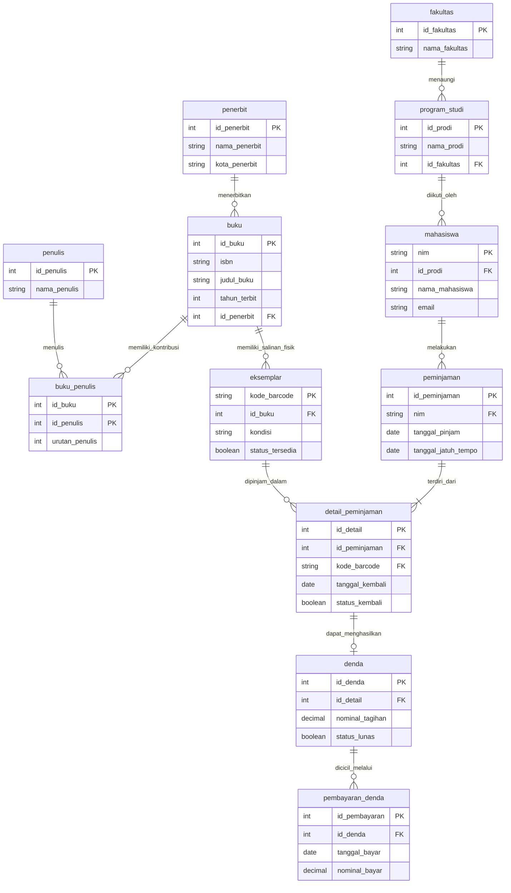

# Tugas Mandiri Modul 6: Perancangan Basis Data E-Library Kampus (Normalisasi hingga 3NF)

| | |
| --- | --- |
| **Nama** | [Isi nama lengkap] |
| **NIM** | [Isi NIM] |
| **Mata Kuliah** | Pemrograman Website |
| **Modul** | 6 — Pemodelan Data dan Konsep Basis Data Relasional |
| **Institusi** | Departemen Teknik Informatika, Fakultas Teknik, Universitas Hasanuddin |

## Daftar Isi

1. [Skenario dan Ruang Lingkup](#1-skenario-dan-ruang-lingkup)
2. [Asumsi dan Aturan Bisnis](#2-asumsi-dan-aturan-bisnis)
3. [Desain ERD Logis: Entitas Inti sesuai Spesifikasi](#3-desain-erd-logis-entitas-inti-sesuai-spesifikasi)
4. [Simulasi Normalisasi Bertahap (UNF sampai 3NF)](#4-simulasi-normalisasi-bertahap-unf-sampai-3nf)
5. [Rancangan Tabel Akhir (Skema 3NF Lengkap)](#5-rancangan-tabel-akhir-skema-3nf-lengkap)
6. [Aturan Integritas Referensial](#6-aturan-integritas-referensial)
7. [Visualisasi Relasi Kunci](#7-visualisasi-relasi-kunci)
8. [Verifikasi 3NF per Tabel](#8-verifikasi-3nf-per-tabel)
9. [Referensi](#9-referensi)

---

## 1. Skenario dan Ruang Lingkup

Sistem **E-Library Kampus** mengelola peminjaman buku perpustakaan kampus. Spesifikasi tugas meminta perancangan ERD logis untuk empat entitas inti: **Mahasiswa**, **Buku**, **Penerbit**, dan **Transaksi Peminjaman**, mencakup pencatatan riwayat peminjaman dan pengembalian.

Dokumen ini sengaja tidak mengulang definisi teoritis ACID/model relasional dari slide modul, karena hal itu bukan bagian dari kriteria spesifikasi tugas. Fokus dokumen ini murni pada lima poin yang diminta: desain ERD, identifikasi atribut/kunci, simulasi normalisasi, rancangan tabel akhir, dan visualisasi relasi kunci.

Bagian 3 merancang keempat entitas tersebut persis sesuai spesifikasi. Bagian 4 kemudian menyimulasikan normalisasi dari data gabungan keempat entitas itu. Dari sanalah kebutuhan tabel pendukung (program studi, fakultas, penulis, eksemplar fisik, denda) **terungkap secara alami** melalui analisis ketergantungan fungsional, bukan ditambahkan begitu saja di awal tanpa alasan.

---

## 2. Asumsi dan Aturan Bisnis

1. Satu transaksi peminjaman dapat mencakup **lebih dari satu buku** (mahasiswa sering meminjam beberapa buku sekaligus di satu kunjungan). Ini baru dapat terlihat setelah normalisasi, sehingga model logis awal di Bagian 3 masih menyederhanakannya sebagai satu transaksi = satu buku.
2. Satu judul buku dapat memiliki **lebih dari satu penulis** (multi-pengarang), dan satu judul buku dapat memiliki **lebih dari satu eksemplar fisik** di rak (dikenali lewat kode barcode). Perpustakaan meminjamkan eksemplar fisik tertentu, bukan sekadar "judul buku".
3. Setiap buku diterbitkan oleh tepat satu penerbit. Satu penerbit dapat menerbitkan banyak buku.
4. Mahasiswa tercatat pada satu program studi, dan satu program studi bernaung di bawah satu fakultas.
5. Masa pinjam standar 7 hari, denda Rp1.000/hari keterlambatan (nilai contoh, dapat dikonfigurasi). Denda dicatat sebagai nilai historis per transaksi, bukan dihitung ulang otomatis, agar tidak berubah jika kebijakan berganti di kemudian hari.
6. Denda dapat dibayar bertahap/mencicil, sehingga riwayat pembayaran perlu tersimpan terpisah dari tagihan itu sendiri — sejalan dengan cakupan skenario "riwayat peminjaman **dan pengembalian**".
7. `tanggal_kembali` bernilai `NULL` selama eksemplar belum dikembalikan.
8. Seluruh data contoh pada dokumen ini fiktif dan hanya untuk ilustrasi.

---

## 3. Desain ERD Logis: Entitas Inti sesuai Spesifikasi

| Entitas | Atribut | Primary Key | Foreign Key |
| --- | --- | --- | --- |
| **Mahasiswa** | `nim`, `nama_mahasiswa`, `email`, `nama_prodi`, `nama_fakultas` | `nim` | - |
| **Penerbit** | `penerbit_id`, `nama_penerbit`, `kota_penerbit` | `penerbit_id` | - |
| **Buku** | `isbn`, `judul_buku`, `tahun_terbit`, `nama_penulis`\*, `penerbit_id` | `isbn` | `penerbit_id` → Penerbit |
| **Transaksi Peminjaman** | `peminjaman_id`, `nim`, `isbn`\*, `tanggal_pinjam`, `tanggal_jatuh_tempo`, `tanggal_kembali`, `denda` | `peminjaman_id` | `nim` → Mahasiswa; `isbn` → Buku |

\* Ditandai karena berpotensi bernilai **lebih dari satu** per baris (satu buku bisa berpenulis lebih dari satu orang; satu transaksi bisa mencakup lebih dari satu buku). Kolom bertanda ini akan dianalisis ulang pada proses normalisasi di Bagian 4, karena atribut yang tidak atomik/bernilai jamak tidak boleh disimpan sebagai satu kolom biasa.

**Relasi awal (sebelum normalisasi):**

| Relasi | Kardinalitas | Penjelasan |
| --- | --- | --- |
| Penerbit - Buku | 1 : N | Satu penerbit menerbitkan banyak buku |
| Mahasiswa - Transaksi Peminjaman | 1 : N | Satu mahasiswa melakukan banyak transaksi |
| Buku - Transaksi Peminjaman | 1 : N (awal) | Diperiksa ulang di Bagian 4 karena satu transaksi bisa berisi banyak buku, sehingga sebenarnya M : N |

---

## 4. Simulasi Normalisasi Bertahap (UNF sampai 3NF)

### 4.1 Data Contoh

**Mahasiswa**

| nim | nama | email | prodi | fakultas |
| --- | --- | --- | --- | --- |
| D121241001 | Rian | rian@student.unhas.ac.id | Informatika | Teknik |
| D121241002 | Akbar | akbar@student.unhas.ac.id | Akuntansi | Ekonomi dan Bisnis |

**Buku, penulis, dan eksemplar**

| isbn | judul | tahun | penulis | penerbit | kota | eksemplar |
| --- | --- | --- | --- | --- | --- | --- |
| 9786020000011 | Dasar-Dasar Basis Data | 2021 | Budi Santoso | Informatika Nusantara | Bandung | BC-001, BC-002 |
| 9786020000028 | Pemrograman Web Modern | 2022 | Siti Rahma, Joko Prasetyo | Media Teknik Press | Jakarta | BC-101 |

**Riwayat transaksi**

| Transaksi | Mahasiswa | Pinjam | Jatuh Tempo | Item |
| --- | --- | --- | --- | --- |
| 1 | Rian | 2026-09-01 | 2026-09-08 | BC-001 (kembali 09-07, tepat waktu); BC-101 (kembali 09-10, telat 2 hari, denda 2000) |
| 2 | Rian | 2026-09-15 | 2026-09-22 | BC-002 (kembali 09-20, tepat waktu) |
| 3 | Akbar | 2026-09-03 | 2026-09-10 | BC-002 (kembali 09-09, tepat waktu) |

### 4.2 Unnormalized Form (UNF)

Seluruh data digabung dalam satu form per mahasiswa. Kolom riwayat peminjaman berisi kelompok berulang, dan di dalamnya kolom penulis berisi kelompok berulang lagi (**bersarang dua tingkat**) karena satu item pinjaman bisa memiliki lebih dari satu penulis.

| NIM | Nama | Email | Prodi | Fakultas | Riwayat Peminjaman (kelompok berulang bersarang) |
| --- | --- | --- | --- | --- | --- |
| D121241001 | Rian | rian@student.unhas.ac.id | Informatika | Teknik | {Transaksi:1, Pinjam:2026-09-01, JatuhTempo:2026-09-08, Barcode:BC-001, ISBN:9786020000011, Judul:Dasar-Dasar Basis Data, Tahun:2021, Penerbit:Informatika Nusantara, Kota:Bandung, Penulis:{Budi Santoso}, Kembali:2026-09-07, Denda:0}<br>{Transaksi:1, Pinjam:2026-09-01, JatuhTempo:2026-09-08, Barcode:BC-101, ISBN:9786020000028, Judul:Pemrograman Web Modern, Tahun:2022, Penerbit:Media Teknik Press, Kota:Jakarta, Penulis:{Siti Rahma, Joko Prasetyo}, Kembali:2026-09-10, Denda:2000}<br>{Transaksi:2, Pinjam:2026-09-15, JatuhTempo:2026-09-22, Barcode:BC-002, ISBN:9786020000011, Judul:Dasar-Dasar Basis Data, Tahun:2021, Penerbit:Informatika Nusantara, Kota:Bandung, Penulis:{Budi Santoso}, Kembali:2026-09-20, Denda:0} |
| D121241002 | Akbar | akbar@student.unhas.ac.id | Akuntansi | Ekonomi dan Bisnis | {Transaksi:3, Pinjam:2026-09-03, JatuhTempo:2026-09-10, Barcode:BC-002, ISBN:9786020000011, Judul:Dasar-Dasar Basis Data, Tahun:2021, Penerbit:Informatika Nusantara, Kota:Bandung, Penulis:{Budi Santoso}, Kembali:2026-09-09, Denda:0} |

**Masalah:** kolom terakhir memuat lebih dari satu nilai, dan salah satu sub-kolomnya (`Penulis`) bahkan memuat kelompok berulang di dalam kelompok berulang. Tabel ini belum memenuhi syarat paling dasar sekalipun.

### 4.3 Konversi ke 1NF: Menghilangkan Kelompok Berulang

Setiap sel dipastikan atomik. Karena ada **dua tingkat** kelompok berulang (item pinjaman, lalu penulis di dalamnya), setiap item dengan *n* penulis menghasilkan *n* baris — item BC-101 (2 penulis) pecah menjadi 2 baris yang identik kecuali kolom penulis.

Kunci utama sementara: **(nim, kode_barcode, tanggal_pinjam, nama_penulis)** — empat kolom diperlukan karena barcode yang sama bisa dipinjam ulang pada tanggal berbeda, dan satu barcode pada satu tanggal pinjam bisa punya lebih dari satu baris hanya karena banyak penulis.

| nim | kode_barcode | tgl_pinjam | nama_penulis | nama_mhs | email | prodi | fakultas | isbn | judul_buku | tahun | nama_penerbit | kota_penerbit | jatuh_tempo | tgl_kembali | denda |
| --- | --- | --- | --- | --- | --- | --- | --- | --- | --- | --- | --- | --- | --- | --- | --- |
| D121241001 | BC-001 | 2026-09-01 | Budi Santoso | Rian | rian@student.unhas.ac.id | Informatika | Teknik | 9786020000011 | Dasar-Dasar Basis Data | 2021 | Informatika Nusantara | Bandung | 2026-09-08 | 2026-09-07 | 0 |
| D121241001 | BC-101 | 2026-09-01 | Siti Rahma | Rian | rian@student.unhas.ac.id | Informatika | Teknik | 9786020000028 | Pemrograman Web Modern | 2022 | Media Teknik Press | Jakarta | 2026-09-08 | 2026-09-10 | 2000 |
| D121241001 | BC-101 | 2026-09-01 | Joko Prasetyo | Rian | rian@student.unhas.ac.id | Informatika | Teknik | 9786020000028 | Pemrograman Web Modern | 2022 | Media Teknik Press | Jakarta | 2026-09-08 | 2026-09-10 | 2000 |
| D121241001 | BC-002 | 2026-09-15 | Budi Santoso | Rian | rian@student.unhas.ac.id | Informatika | Teknik | 9786020000011 | Dasar-Dasar Basis Data | 2021 | Informatika Nusantara | Bandung | 2026-09-22 | 2026-09-20 | 0 |
| D121241002 | BC-002 | 2026-09-03 | Budi Santoso | Akbar | akbar@student.unhas.ac.id | Akuntansi | Ekonomi dan Bisnis | 9786020000011 | Dasar-Dasar Basis Data | 2021 | Informatika Nusantara | Bandung | 2026-09-10 | 2026-09-09 | 0 |

**Masalah 1NF:** baris ke-2 dan ke-3 identik di semua kolom kecuali `nama_penulis` — redundansi murni akibat memaksakan atribut bernilai-jamak menjadi kolom biasa. "Informatika Nusantara"/"Bandung" juga terulang di tiga baris. Perubahan kecil (mis. kota penerbit pindah) harus diedit di banyak baris sekaligus (anomali ubah); menghapus baris BC-002 milik Akbar berisiko menghapus info penerbit jika baris itu satu-satunya kemunculan.

**Analisis ketergantungan fungsional (FD):**

```text
nim                          -> nama_mhs, email, prodi, fakultas
kode_barcode                 -> isbn, judul_buku, tahun, nama_penerbit, kota_penerbit
kode_barcode, tgl_pinjam     -> nim, jatuh_tempo, tgl_kembali, denda
                                 (aturan bisnis: satu eksemplar hanya dipinjam
                                 satu orang dalam satu rentang waktu)
isbn                         -> {nama_penulis}   -- BUKAN FD biasa, melainkan
                                                     fakta many-to-many (satu ISBN
                                                     bisa berelasi dengan banyak
                                                     penulis, dan satu penulis bisa
                                                     menulis banyak ISBN)
```

Baris terakhir bukan ketergantungan fungsional sama sekali — `nama_penulis` tidak "ditentukan" oleh `isbn` karena nilainya bisa lebih dari satu. Ini pelanggaran atomicity/1NF pada level pemodelan, bukan sekadar isu 2NF/3NF, sehingga relasi penulis-buku harus segera dipisah menjadi relasi many-to-many tersendiri sebelum melanjutkan analisis dependensi kolom lainnya.

### 4.4 Konversi ke 2NF: Memisahkan Kelompok Many-to-Many dan Ketergantungan Parsial

**Langkah A - keluarkan relasi many-to-many penulis-buku** (lihat FD terakhir di atas):

**Tabel `penulis_2nf`**

| isbn | nama_penulis |
| --- | --- |
| 9786020000011 | Budi Santoso |
| 9786020000028 | Siti Rahma |
| 9786020000028 | Joko Prasetyo |

**Langkah B - pisahkan ketergantungan parsial** terhadap kunci komposit (nim, kode_barcode, tgl_pinjam) yang tersisa setelah kolom penulis dikeluarkan:

**Tabel `mahasiswa_2nf`** (bergantung penuh pada `nim` saja)

| nim | nama_mhs | email | prodi | fakultas |
| --- | --- | --- | --- | --- |
| D121241001 | Rian | rian@student.unhas.ac.id | Informatika | Teknik |
| D121241002 | Akbar | akbar@student.unhas.ac.id | Akuntansi | Ekonomi dan Bisnis |

**Tabel `buku_eksemplar_2nf`** (bergantung penuh pada `kode_barcode` saja)

| kode_barcode | isbn | judul_buku | tahun | nama_penerbit | kota_penerbit |
| --- | --- | --- | --- | --- | --- |
| BC-001 | 9786020000011 | Dasar-Dasar Basis Data | 2021 | Informatika Nusantara | Bandung |
| BC-002 | 9786020000011 | Dasar-Dasar Basis Data | 2021 | Informatika Nusantara | Bandung |
| BC-101 | 9786020000028 | Pemrograman Web Modern | 2022 | Media Teknik Press | Jakarta |

**Tabel `peminjaman_2nf`** (bergantung penuh pada kunci `kode_barcode + tgl_pinjam`)

| kode_barcode | tgl_pinjam | nim | jatuh_tempo | tgl_kembali | denda |
| --- | --- | --- | --- | --- | --- |
| BC-001 | 2026-09-01 | D121241001 | 2026-09-08 | 2026-09-07 | 0 |
| BC-101 | 2026-09-01 | D121241001 | 2026-09-08 | 2026-09-10 | 2000 |
| BC-002 | 2026-09-15 | D121241001 | 2026-09-22 | 2026-09-20 | 0 |
| BC-002 | 2026-09-03 | D121241002 | 2026-09-10 | 2026-09-09 | 0 |

**Masalah tersisa (transitif):**
- Pada `buku_eksemplar_2nf`, `kode_barcode` bukan lagi kunci tunggal terhadap `isbn` — `isbn` sendiri menentukan `judul_buku`, `tahun`, dan (lewat penerbit) `nama_penerbit`/`kota_penerbit`. Jadi `kode_barcode -> isbn -> judul_buku` dan `kode_barcode -> isbn -> nama_penerbit -> kota_penerbit` adalah rantai transitif **dua tingkat**.
- Pada `mahasiswa_2nf`, `nim -> prodi -> fakultas` adalah ketergantungan transitif: fakultas ditentukan oleh prodi, bukan langsung oleh nim.

### 4.5 Konversi ke 3NF: Menghilangkan Ketergantungan Transitif

Setiap rantai transitif dipecah dengan mengeluarkan atribut yang bergantung pada atribut bukan-kunci lain ke tabel barunya sendiri.

**Dari `buku_eksemplar_2nf`:**

**Tabel `buku_3nf`** (kunci `isbn`)

| isbn | judul_buku | tahun | nama_penerbit | kota_penerbit |
| --- | --- | --- | --- | --- |
| 9786020000011 | Dasar-Dasar Basis Data | 2021 | Informatika Nusantara | Bandung |
| 9786020000028 | Pemrograman Web Modern | 2022 | Media Teknik Press | Jakarta |

**Tabel `eksemplar_3nf`** (kunci `kode_barcode`)

| kode_barcode | isbn |
| --- | --- |
| BC-001 | 9786020000011 |
| BC-002 | 9786020000011 |
| BC-101 | 9786020000028 |

Rantai masih menyisakan `isbn -> nama_penerbit -> kota_penerbit`, sehingga penerbit dipisah sekali lagi:

**Tabel `penerbit_3nf`** (kunci baru `id_penerbit`)

| id_penerbit | nama_penerbit | kota_penerbit |
| --- | --- | --- |
| 1 | Informatika Nusantara | Bandung |
| 2 | Media Teknik Press | Jakarta |

**Dari `mahasiswa_2nf`:**

**Tabel `program_studi_3nf`** (kunci baru `id_prodi`)

| id_prodi | nama_prodi | nama_fakultas |
| --- | --- | --- |
| 1 | Informatika | Teknik |
| 2 | Akuntansi | Ekonomi dan Bisnis |

`nama_fakultas` di tabel ini masih berulang setiap kali ada prodi baru di fakultas yang sama — jika Universitas menambah prodi "Sistem Informasi" di Fakultas Teknik, nama "Teknik" akan tertulis ulang. Ini transitif tingkat kedua (`id_prodi -> nama_fakultas`) yang tidak terlihat pada dua baris contoh di atas (karena kedua fakultas kebetulan berbeda), tetapi akan muncul begitu ada dua prodi dalam satu fakultas yang sama. Untuk konsisten dan aman dari kasus tersebut, fakultas dipisah juga:

**Tabel `fakultas_3nf`** (kunci baru `id_fakultas`)

| id_fakultas | nama_fakultas |
| --- | --- |
| 1 | Teknik |
| 2 | Ekonomi dan Bisnis |

**Tabel `program_studi_final`**

| id_prodi | nama_prodi | id_fakultas |
| --- | --- | --- |
| 1 | Informatika | 1 |
| 2 | Akuntansi | 2 |

**Tabel `mahasiswa_3nf`** (kunci `nim`)

| nim | nama_mhs | email | id_prodi |
| --- | --- | --- | --- |
| D121241001 | Rian | rian@student.unhas.ac.id | 1 |
| D121241002 | Akbar | akbar@student.unhas.ac.id | 2 |

Tabel `penulis_2nf` dan `peminjaman_2nf` tidak memiliki ketergantungan transitif (setiap atribut bukan kunci bergantung langsung pada keseluruhan kunci utamanya), sehingga keduanya sudah memenuhi 3NF tanpa perubahan struktural lebih lanjut.

Pada titik ini seluruh tabel telah memenuhi 3NF secara formal: **fakultas, program_studi, mahasiswa, penerbit, buku, penulis (via relasi many-to-many), eksemplar, peminjaman**. Bagian 4.6 menambahkan penyempurnaan desain fisik yang **bukan tuntutan normalisasi**, melainkan keputusan rekayasa agar skema mudah dipakai pada implementasi nyata.

### 4.6 Penyempurnaan Desain Fisik (Pasca-3NF)

Tiga penyempurnaan berikut ditambahkan setelah 3NF tercapai, dengan alasan masing-masing (bukan karena melanggar bentuk normal manapun):

1. **`penulis_2nf` diberi kunci pengganti.** Nama penulis dijadikan entitas `penulis(id_penulis, nama_penulis)` dan relasinya menjadi tabel penghubung `buku_penulis(id_buku, id_penulis)`, agar nama penulis yang sama (mis. penulis produktif dengan banyak judul) tidak diketik ulang dan rawan salah eja di setiap baris relasi.
2. **`peminjaman_2nf` dipecah menjadi header dan detail.** Karena satu transaksi kunjungan mahasiswa bisa mencakup beberapa eksemplar sekaligus (Asumsi 1 di Bagian 2), data dikelompokkan ulang menjadi `peminjaman` (header: `id_peminjaman`, `nim`, `tanggal_pinjam`, `tanggal_jatuh_tempo`) dan `detail_peminjaman` (baris per eksemplar: `id_detail`, `id_peminjaman`, `kode_barcode`, `tanggal_kembali`). Pola *header-detail* ini lazim untuk transaksi multi-item dan tidak mengubah status normalisasi, karena `(id_peminjaman, kode_barcode)` tetap merupakan kunci kandidat yang sah untuk `detail_peminjaman` — `id_detail` hanya kunci pengganti yang lebih ringkas dirujuk oleh tabel lain.
3. **Denda dipisah dari `detail_peminjaman`, dan ditambahkan riwayat pembayarannya.** Sesuai Asumsi 6, denda perlu mendukung pembayaran bertahap, sehingga dipecah menjadi `denda` (tagihan) dan `pembayaran_denda` (histori pembayaran, boleh lebih dari satu baris per tagihan).

Hasil akhir kedua belas tabel ini dirinci lengkap dengan tipe data pada Bagian 5.

---

## 5. Rancangan Tabel Akhir (Skema 3NF Lengkap)

Tipe data mengacu pada MySQL/MariaDB, sejalan dengan Modul 7 (SQL dan phpMyAdmin).

### 5.1 Modul Akademik & Anggota

**Tabel `fakultas`**

| Kolom | Tipe Data | Kunci | NULL | Keterangan |
| --- | --- | --- | --- | --- |
| `id_fakultas` | `INT AUTO_INCREMENT` | PK | Tidak | Kode unik fakultas |
| `nama_fakultas` | `VARCHAR(100)` | UNIQUE | Tidak | Nama fakultas |

**Tabel `program_studi`**

| Kolom | Tipe Data | Kunci | NULL | Keterangan |
| --- | --- | --- | --- | --- |
| `id_prodi` | `INT AUTO_INCREMENT` | PK | Tidak | Kode unik program studi |
| `nama_prodi` | `VARCHAR(100)` | UNIQUE | Tidak | Nama program studi |
| `id_fakultas` | `INT` | FK | Tidak | Merujuk `fakultas.id_fakultas` |

**Tabel `mahasiswa`**

| Kolom | Tipe Data | Kunci | NULL | Keterangan |
| --- | --- | --- | --- | --- |
| `nim` | `VARCHAR(15)` | PK | Tidak | Nomor induk mahasiswa |
| `id_prodi` | `INT` | FK | Tidak | Merujuk `program_studi.id_prodi` |
| `nama_mahasiswa` | `VARCHAR(100)` | - | Tidak | Nama lengkap mahasiswa |
| `email` | `VARCHAR(100)` | UNIQUE | Tidak | Surel aktif mahasiswa |

### 5.2 Modul Katalog & Kepenulisan

**Tabel `penerbit`**

| Kolom | Tipe Data | Kunci | NULL | Keterangan |
| --- | --- | --- | --- | --- |
| `id_penerbit` | `INT AUTO_INCREMENT` | PK | Tidak | Kode unik penerbit |
| `nama_penerbit` | `VARCHAR(100)` | UNIQUE | Tidak | Nama penerbit |
| `kota_penerbit` | `VARCHAR(50)` | - | Tidak | Kota kedudukan penerbit |

**Tabel `penulis`**

| Kolom | Tipe Data | Kunci | NULL | Keterangan |
| --- | --- | --- | --- | --- |
| `id_penulis` | `INT AUTO_INCREMENT` | PK | Tidak | Kode unik penulis |
| `nama_penulis` | `VARCHAR(100)` | - | Tidak | Nama penulis |

**Tabel `buku`**

| Kolom | Tipe Data | Kunci | NULL | Keterangan |
| --- | --- | --- | --- | --- |
| `id_buku` | `INT AUTO_INCREMENT` | PK | Tidak | Kode unik judul buku |
| `isbn` | `VARCHAR(20)` | UNIQUE | Tidak | Nomor ISBN |
| `judul_buku` | `VARCHAR(200)` | - | Tidak | Judul buku |
| `tahun_terbit` | `YEAR` | - | Tidak | Tahun terbit |
| `id_penerbit` | `INT` | FK | Tidak | Merujuk `penerbit.id_penerbit` |

**Tabel `buku_penulis`** (junction, relasi many-to-many)

| Kolom | Tipe Data | Kunci | NULL | Keterangan |
| --- | --- | --- | --- | --- |
| `id_buku` | `INT` | PK Komposit, FK | Tidak | Merujuk `buku.id_buku` |
| `id_penulis` | `INT` | PK Komposit, FK | Tidak | Merujuk `penulis.id_penulis` |
| `urutan_penulis` | `TINYINT` | - | Tidak | Urutan penulis (1 = penulis utama), default `1` |

### 5.3 Modul Inventaris Fisik

**Tabel `eksemplar`**

| Kolom | Tipe Data | Kunci | NULL | Keterangan |
| --- | --- | --- | --- | --- |
| `kode_barcode` | `VARCHAR(50)` | PK | Tidak | Kode fisik unik per eksemplar |
| `id_buku` | `INT` | FK | Tidak | Merujuk `buku.id_buku` |
| `kondisi` | `ENUM('Baik','Rusak','Hilang')` | - | Tidak | Kondisi fisik, default `'Baik'` |
| `status_tersedia` | `BOOLEAN` | - | Tidak | Ketersediaan saat ini, default `TRUE` |

### 5.4 Modul Sirkulasi dan Keuangan

**Tabel `peminjaman`** (header transaksi)

| Kolom | Tipe Data | Kunci | NULL | Keterangan |
| --- | --- | --- | --- | --- |
| `id_peminjaman` | `INT AUTO_INCREMENT` | PK | Tidak | Nomor transaksi peminjaman |
| `nim` | `VARCHAR(15)` | FK | Tidak | Merujuk `mahasiswa.nim` |
| `tanggal_pinjam` | `DATE` | - | Tidak | Tanggal transaksi dibuat |
| `tanggal_jatuh_tempo` | `DATE` | - | Tidak | Batas akhir pengembalian seluruh item, `>= tanggal_pinjam` |

**Tabel `detail_peminjaman`** (rincian per eksemplar)

| Kolom | Tipe Data | Kunci | NULL | Keterangan |
| --- | --- | --- | --- | --- |
| `id_detail` | `INT AUTO_INCREMENT` | PK | Tidak | Nomor baris item peminjaman |
| `id_peminjaman` | `INT` | FK | Tidak | Merujuk `peminjaman.id_peminjaman` |
| `kode_barcode` | `VARCHAR(50)` | FK | Tidak | Merujuk `eksemplar.kode_barcode` |
| `tanggal_kembali` | `DATE` | - | **Ya** | `NULL` berarti belum dikembalikan |
| `status_kembali` | `BOOLEAN` | - | Tidak | Default `FALSE`; lihat catatan denormalisasi di 5.5 |

Constraint tambahan: `UNIQUE (id_peminjaman, kode_barcode)` agar satu eksemplar tidak tercatat dua kali dalam transaksi yang sama.

**Tabel `denda`** (tagihan)

| Kolom | Tipe Data | Kunci | NULL | Keterangan |
| --- | --- | --- | --- | --- |
| `id_denda` | `INT AUTO_INCREMENT` | PK | Tidak | Nomor tagihan denda |
| `id_detail` | `INT` | FK, UNIQUE | Tidak | Merujuk `detail_peminjaman.id_detail`; maksimal satu tagihan per item |
| `nominal_tagihan` | `DECIMAL(10,2)` | - | Tidak | Total denda, `>= 0` |
| `status_lunas` | `BOOLEAN` | - | Tidak | Default `FALSE`; lihat catatan denormalisasi di 5.5 |

**Tabel `pembayaran_denda`** (histori pembayaran, mendukung cicilan)

| Kolom | Tipe Data | Kunci | NULL | Keterangan |
| --- | --- | --- | --- | --- |
| `id_pembayaran` | `INT AUTO_INCREMENT` | PK | Tidak | Nomor bukti pembayaran |
| `id_denda` | `INT` | FK | Tidak | Merujuk `denda.id_denda` |
| `tanggal_bayar` | `DATE` | - | Tidak | Tanggal pembayaran dilakukan |
| `nominal_bayar` | `DECIMAL(10,2)` | - | Tidak | Nominal dibayarkan, `> 0` |

**Contoh isi akhir (melanjutkan data contoh Bagian 4.1):**

`peminjaman`

| id_peminjaman | nim | tanggal_pinjam | tanggal_jatuh_tempo |
| --- | --- | --- | --- |
| 1 | D121241001 | 2026-09-01 | 2026-09-08 |
| 2 | D121241001 | 2026-09-15 | 2026-09-22 |
| 3 | D121241002 | 2026-09-03 | 2026-09-10 |

`detail_peminjaman`

| id_detail | id_peminjaman | kode_barcode | tanggal_kembali | status_kembali |
| --- | --- | --- | --- | --- |
| 1 | 1 | BC-001 | 2026-09-07 | TRUE |
| 2 | 1 | BC-101 | 2026-09-10 | TRUE |
| 3 | 2 | BC-002 | 2026-09-20 | TRUE |
| 4 | 3 | BC-002 | 2026-09-09 | TRUE |

`denda` dan `pembayaran_denda` (hanya item BC-101 yang telat, 2 hari x Rp1.000)

| id_denda | id_detail | nominal_tagihan | status_lunas |
| --- | --- | --- | --- |
| 1 | 2 | 2000.00 | TRUE |

| id_pembayaran | id_denda | tanggal_bayar | nominal_bayar |
| --- | --- | --- | --- |
| 1 | 1 | 2026-09-11 | 1000.00 |
| 2 | 1 | 2026-09-14 | 1000.00 |

### 5.5 Catatan: Denormalisasi Terkendali

Dua kolom di atas secara teknis **redundan** terhadap kolom lain, tapi sengaja dipertahankan sebagai trade-off performa, bukan kesalahan normalisasi yang tidak disadari:

- `detail_peminjaman.status_kembali` bisa diturunkan dari `tanggal_kembali IS NOT NULL`. Kolom ini dipertahankan agar query "daftar peminjaman aktif" bisa memakai index biasa tanpa bergantung pada pemeriksaan `NULL`.
- `denda.status_lunas` bisa diturunkan dari `SUM(pembayaran_denda.nominal_bayar) >= nominal_tagihan`. Kolom ini dipertahankan agar status lunas/belum bisa difilter langsung tanpa agregasi setiap kali ditampilkan.

Konsekuensinya, aplikasi (bukan basis data) bertanggung jawab menjaga kedua kolom ini tetap sinkron dengan sumber kebenarannya setiap kali terjadi transaksi pengembalian atau pembayaran.

---

## 6. Aturan Integritas Referensial

Riwayat peminjaman dan riwayat keuangan adalah data historis yang wajib dipertahankan, sehingga sebagian besar relasi memakai `RESTRICT` pada penghapusan. Pengecualian diberi alasan eksplisit.

| Foreign Key | Tabel Induk | ON DELETE | ON UPDATE | Alasan |
| --- | --- | --- | --- | --- |
| `program_studi.id_fakultas` | `fakultas` | RESTRICT | CASCADE | Fakultas tidak boleh dihapus selagi masih menaungi prodi |
| `mahasiswa.id_prodi` | `program_studi` | RESTRICT | CASCADE | Prodi tidak boleh dihapus selagi masih punya mahasiswa aktif/riwayat |
| `buku.id_penerbit` | `penerbit` | RESTRICT | CASCADE | Penerbit tidak boleh dihapus selagi masih menerbitkan buku |
| `buku_penulis.id_buku` | `buku` | CASCADE | CASCADE | Baris relasi ini murni metadata asosiasi, tidak bermakna tanpa bukunya |
| `buku_penulis.id_penulis` | `penulis` | CASCADE | CASCADE | Sama seperti di atas, untuk sisi penulis |
| `eksemplar.id_buku` | `buku` | RESTRICT | CASCADE | Judul buku tidak boleh dihapus selagi masih ada eksemplar fisik terdaftar |
| `peminjaman.nim` | `mahasiswa` | RESTRICT | CASCADE | Riwayat peminjaman mahasiswa wajib dipertahankan meski mahasiswa lulus |
| `detail_peminjaman.id_peminjaman` | `peminjaman` | CASCADE | CASCADE | Baris detail tidak bermakna berdiri sendiri tanpa header transaksinya |
| `detail_peminjaman.kode_barcode` | `eksemplar` | RESTRICT | CASCADE | Eksemplar yang pernah punya riwayat pinjam tidak boleh dihapus keras (gunakan `kondisi`/`status_tersedia` untuk menonaktifkan) |
| `denda.id_detail` | `detail_peminjaman` | CASCADE | CASCADE | Mengikuti siklus hidup detail peminjamannya |
| `pembayaran_denda.id_denda` | `denda` | RESTRICT | CASCADE | Riwayat pembayaran adalah jejak audit keuangan dan tidak boleh hilang otomatis |

**Catatan interaksi CASCADE-RESTRICT:** menghapus satu `peminjaman` akan otomatis mem-berantai-hapus `detail_peminjaman` dan `denda` terkait (baris 8 dan 10). Namun jika `denda` tersebut sudah memiliki baris di `pembayaran_denda`, baris 11 (`RESTRICT`) akan menolak penghapusan di tengah rantai — sehingga transaksi yang sudah ada pembayarannya justru terlindungi dari penghapusan tidak sengaja, meski headernya sendiri diberi aturan CASCADE.

---

## 7. Visualisasi Relasi Kunci

### 7.1 Diagram ERD (Mermaid)



Notasi: `||` = tepat satu, `o{` = nol atau banyak, `|{` = satu atau banyak, `o|` = nol atau satu.

### 7.2 Peta Relasi Kunci (Ringkasan, Diagram Alur Teks)

```text
fakultas -> program_studi -> mahasiswa -> peminjaman -> detail_peminjaman -> denda -> pembayaran_denda
                                                                 ^
                                                             eksemplar <- buku <- penerbit
                                                                                    ^
                                                                              buku_penulis <- penulis
```

Pembacaan diagram:
- Anak panah menunjuk dari tabel anak (pemegang Foreign Key) ke tabel induk (pemegang Primary Key yang dirujuk).
- `detail_peminjaman` adalah penghubung many-to-many antara `peminjaman` dan `eksemplar`.
- `buku_penulis` adalah penghubung many-to-many antara `buku` dan `penulis`.
- Setiap Foreign Key wajib merujuk nilai yang benar-benar ada di tabel induk.

---

## 8. Verifikasi 3NF per Tabel

| Tabel | Kunci Utama | Ketergantungan Fungsional | Status |
| --- | --- | --- | --- |
| `fakultas` | `id_fakultas` | `id_fakultas` → `nama_fakultas` | 3NF |
| `program_studi` | `id_prodi` | `id_prodi` → `nama_prodi`, `id_fakultas` | 3NF |
| `mahasiswa` | `nim` | `nim` → `id_prodi`, `nama_mahasiswa`, `email` | 3NF |
| `penerbit` | `id_penerbit` | `id_penerbit` → `nama_penerbit`, `kota_penerbit` | 3NF |
| `penulis` | `id_penulis` | `id_penulis` → `nama_penulis` | 3NF |
| `buku` | `id_buku` | `id_buku` → `isbn`, `judul_buku`, `tahun_terbit`, `id_penerbit` | 3NF |
| `buku_penulis` | `id_buku` + `id_penulis` | (`id_buku`, `id_penulis`) → `urutan_penulis` | 3NF |
| `eksemplar` | `kode_barcode` | `kode_barcode` → `id_buku`, `kondisi`, `status_tersedia` | 3NF |
| `peminjaman` | `id_peminjaman` | `id_peminjaman` → `nim`, `tanggal_pinjam`, `tanggal_jatuh_tempo` | 3NF |
| `detail_peminjaman` | `id_detail` (kandidat: `id_peminjaman`+`kode_barcode`) | `id_detail` → `id_peminjaman`, `kode_barcode`, `tanggal_kembali`, `status_kembali` | 3NF |
| `denda` | `id_denda` | `id_denda` → `id_detail`, `nominal_tagihan`, `status_lunas` | 3NF |
| `pembayaran_denda` | `id_pembayaran` | `id_pembayaran` → `id_denda`, `tanggal_bayar`, `nominal_bayar` | 3NF |

Tidak ada tabel dengan atribut bukan-kunci yang bergantung pada atribut bukan-kunci lainnya, sehingga seluruh skema konsisten memenuhi 3NF.

---

## 9. Referensi

1. Departemen Teknik Informatika, Universitas Hasanuddin. *Modul 6: Pemodelan Data dan Konsep Basis Data Relasional*, mata kuliah Pemrograman Website.
2. Codd, E. F. (1970). "A Relational Model of Data for Large Shared Data Banks." *Communications of the ACM*, 13(6), 377-387.